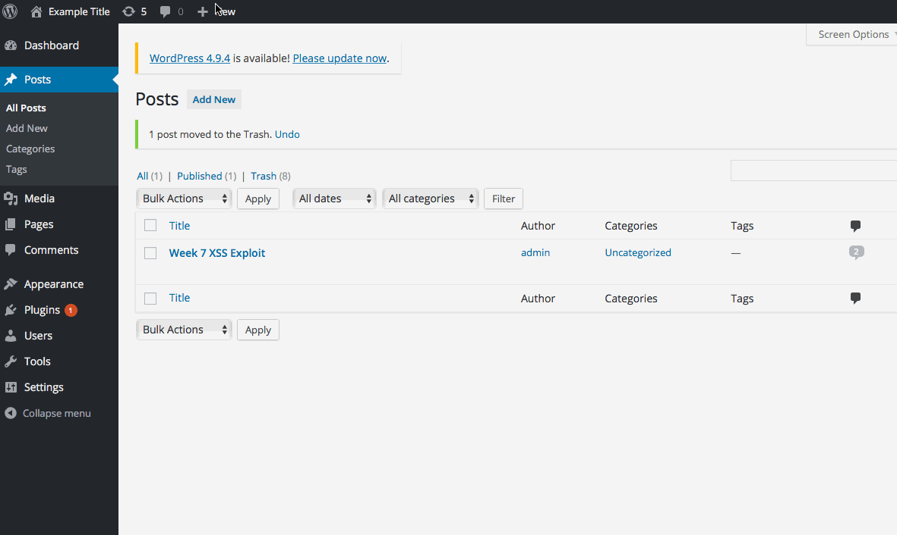

# Wordpress Exploit #1 
<b>Type:</b> Unauthenticated Stored Cross-Site Scripting CVE-2015-3440

Wordpress exploit demo


[!] Title: WordPress <= 4.2 - Unauthenticated Stored Cross-Site Scripting (XSS)
    Reference: https://wpvulndb.com/vulnerabilities/7945
    Reference: http://klikki.fi/adv/wordpress2.html
    Reference: http://packetstormsecurity.com/files/131644/
    Reference: https://www.exploit-db.com/exploits/36844/

Tested in: 4.2

Fixed in: 4.2.1 

Description: 
Hacker can inject JavaScript in WordPress comments. The script is executed when comment is viewed. The comment has to be longer than 64 kb, because this is the maximum size of the text field in MySQL

Step by step:
1. I left a harmless comment under the post to bypass the initial moderation. For the second comment of the same post you won't have to go through the moderation again.
2. I left a long comment to get an alert "Hello World" :
```html
<a title='x onmouseover=alert(unescape(/hello%20world/.source)) style=position:absolute;left:0;top:0;width:5000px;height:5000px  AAAAAAAAAAAA...[64 kb]..AAA'></a>
```
3. When the admin will go to the page where the post is located the injected javascript will be executed and we can see the alert box "Hello world". The same way using different code we can gain access to cookies and to everything that logged in admin can do.

Affected Source Code Link: https://core.trac.wordpress.org/changeset/32299


# Wordpress exploit #2
Type: Authenticated Stored Cross-Site Scripting Reference CVE-2015-5623

Wordpress exploit demo



[!] Title: WordPress <= 4.2.2 - Authenticated Stored Cross-Site Scripting (XSS)
    Reference: https://wpvulndb.com/vulnerabilities/8111
    Reference: https://wordpress.org/news/2015/07/wordpress-4-2-3/
    Reference: https://twitter.com/klikkioy/status/624264122570526720
    Reference: https://klikki.fi/adv/wordpress3.html
    Reference: https://cve.mitre.org/cgi-bin/cvename.cgi?name=CVE-2015-5622
    Reference: https://cve.mitre.org/cgi-bin/cvename.cgi?name=CVE-2015-5623

Tested in: 4.2

Fixed in: 4.2.3

Description:
XSS vulnarability allows a user with posting capabilities to compomise the web site

Step by step:
1. Press "Create a Post" button
2. Switch from visual editor to text editor by choosing a "Text" tab on the righ upper corner.
2. Enter example code that triggers alert message:
```html
<a href="[caption code=">]</a><a title=" onmouseover=alert('test')  ">link</a>
```
3. WordPress shortcode processing manipulates this into the following form
```html
<a href="</a><a title=" onmouseover=alert('test')  ">link</a>
```
3. The code is executed when the user move his cursor over the link 

Affected Source Code Link: https://core.trac.wordpress.org/changeset/33359

# Wordpress exploit #3
Type: Unauthenticated Genericons Cross-Site Scripting

Wordpress exploit demo


[!] Title: WordPress 4.1-4.2.1 - Unauthenticated Genericons Cross-Site Scripting (XSS)
    Reference: https://wpvulndb.com/vulnerabilities/7979
    Reference: https://codex.wordpress.org/Version_4.2.2

Tested in: 4.2

Fixed in: 4.2.2

Description: Genericons packages included in the Twenty Fifteen theme had a vulnurable example.htnl file which provided oportunities for XSS attack

Step by step:
1. Craft a web link by adding the code to existing example.html file in the Twentyfifteen theme:

```html
http://wpdistillery.vm/wp-content/themes/twentyfifteen/genericons/example.html#
```
2. When logged in, copy the link to the browser and press Enter

# Wordpress exploit #4
Type: 

Wordpress exploit demo


